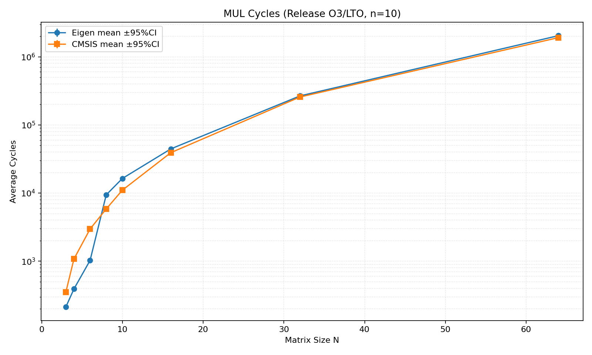
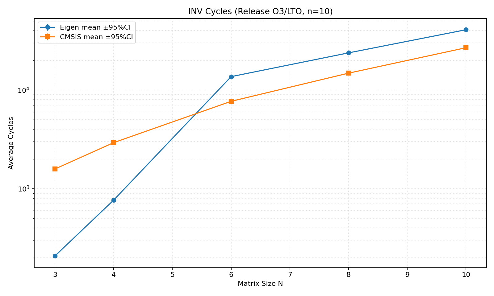
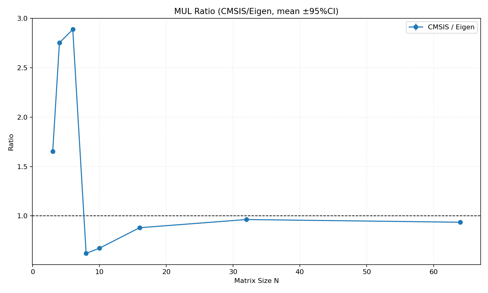
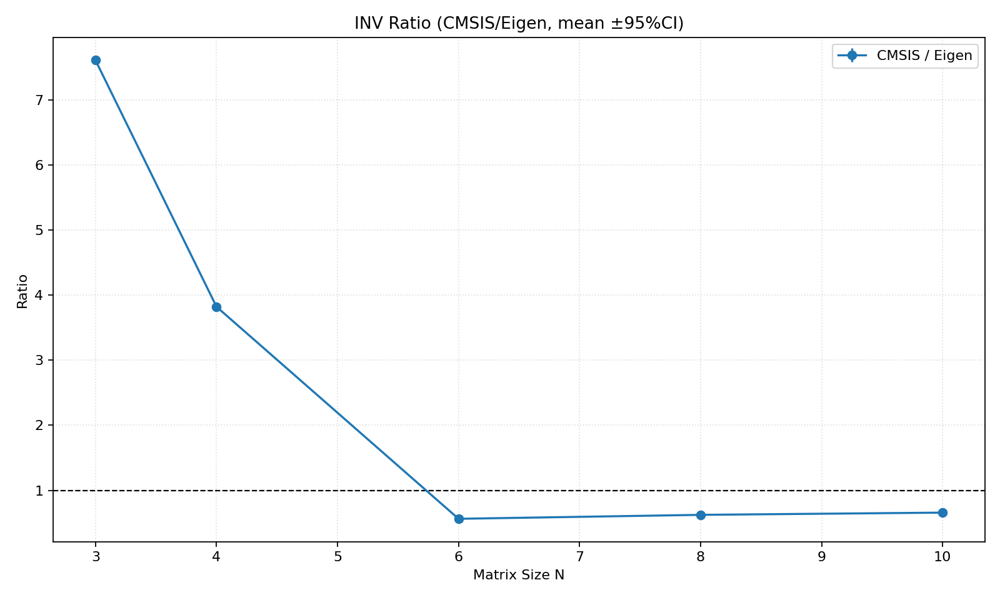

# 基准统计报告（Release/O3/LTO，10 轮）

## 1. 关联计划

- 计划标题：`实验设计报告：Eigen 与 CMSIS-DSP 在 Cortex-M4 平台下的矩阵运算性能基准测试`
- 计划文件：`PLAN.md`

## 2. 构建与采样配置

- 工具链：`starm-clang.exe`
- 构建类型：`Release`
- BENCHMARK_PERF_MODE：`ON`
- 采样轮数：`10`
- 数据目录：`build/Release_starmclang/samples_release`
- build_mode 字段：`Release`

## 3. 口径一致性检查

- `mul` 尺寸应为 `[3, 4, 6, 8, 10, 16, 32, 64]`，实测为 `[3, 4, 6, 8, 10, 16, 32, 64]`
- `inv` 尺寸应为 `[3, 4, 6, 8, 10]`，实测为 `[3, 4, 6, 8, 10]`
- `repeat=100`：`通过`
- `valid+invalid=100`：`通过`
- `error_l2 <= 1e-4`：`通过`

## 4. 可视化结果

### 4.1 乘法周期（均值 ±95%CI）

### 4.2 求逆周期（均值 ±95%CI）

### 4.3 乘法比值（CMSIS/Eigen，均值 ±95%CI）

### 4.4 求逆比值（CMSIS/Eigen，均值 ±95%CI）

## 5. 统计表
>
> 置信区间按正态近似：`mean ± 1.96 * std / sqrt(n)`（n=10）。

### 5.1 乘法统计表

| n | eigen_mean | eigen_var | eigen_95%CI | cmsis_mean | cmsis_var | cmsis_95%CI | ratio_mean | ratio_var | ratio_95%CI |
|---:|---:|---:|---:|---:|---:|---:|---:|---:|---:|
| 3 | 212.94 | 0.00 | ±0.00 | 351.87 | 0.00 | ±0.00 | 1.652 | 0.00000 | ±0.000 |
| 4 | 390.99 | 0.00 | ±0.01 | 1075.81 | 0.00 | ±0.00 | 2.752 | 0.00000 | ±0.000 |
| 6 | 1027.85 | 0.00 | ±0.02 | 2967.81 | 0.01 | ±0.05 | 2.887 | 0.00000 | ±0.000 |
| 8 | 9413.89 | 0.00 | ±0.00 | 5847.98 | 0.00 | ±0.00 | 0.621 | 0.00000 | ±0.000 |
| 10 | 16374.91 | 0.00 | ±0.00 | 11029.98 | 0.00 | ±0.00 | 0.674 | 0.00000 | ±0.000 |
| 16 | 44461.86 | 0.00 | ±0.00 | 39145.98 | 0.00 | ±0.00 | 0.880 | 0.00000 | ±0.000 |
| 32 | 266635.93 | 0.00 | ±0.00 | 256894.98 | 0.00 | ±0.00 | 0.963 | 0.00000 | ±0.000 |
| 64 | 2040878.99 | 0.00 | ±0.01 | 1910429.00 | 0.00 | ±0.00 | 0.936 | 0.00000 | ±0.000 |

### 5.2 求逆统计表

| n | eigen_mean | eigen_var | eigen_95%CI | cmsis_mean | cmsis_var | cmsis_95%CI | ratio_mean | ratio_var | ratio_95%CI |
|---:|---:|---:|---:|---:|---:|---:|---:|---:|---:|
| 3 | 208.03 | 0.00 | ±0.01 | 1583.62 | 0.03 | ±0.10 | 7.613 | 0.00000 | ±0.001 |
| 4 | 766.00 | 0.00 | ±0.00 | 2927.97 | 0.00 | ±0.04 | 3.822 | 0.00000 | ±0.000 |
| 6 | 13662.00 | 0.00 | ±0.00 | 7681.00 | 0.00 | ±0.00 | 0.562 | 0.00000 | ±0.000 |
| 8 | 23796.00 | 0.00 | ±0.00 | 14822.00 | 0.00 | ±0.00 | 0.623 | 0.00000 | ±0.000 |
| 10 | 40829.47 | 0.00 | ±0.00 | 26834.00 | 0.00 | ±0.00 | 0.657 | 0.00000 | ±0.000 |

## 6. 结论摘要

- 10 轮采样均完成，数据完整性通过。
- Release/O3/LTO 下的均值、方差与 95%CI 已给出，可用于正式性能结论的统计基础。
