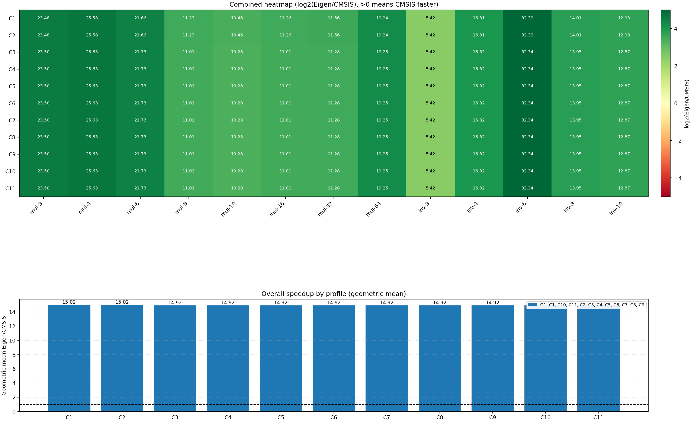

# 可读版全量实验报告（合并同类现象）

## 1. 实验概览
- 计划来源：`/home/keruth/Projects/cmsis-dsp-vs-eigen/PLAN.md`
- 覆盖 profile：`C1, C2, C3, C4, C5, C6, C7, C8, C9, C10, C11`
- 采样轮次（按 profile）：`[('C1', 10), ('C10', 3), ('C11', 3), ('C2', 7), ('C3', 3), ('C4', 3), ('C5', 3), ('C6', 3), ('C7', 3), ('C8', 3), ('C9', 3)]`
- 统计口径：`Eigen/CMSIS`（>1 表示 CMSIS 更快）
- 生成时间：`2026-02-16T19:44:35.576886+00:00`

## 2. 编译与工具链条件
| profile | cflags | cxxflags | ldflags | uses_lto | text | rodata | data | bss |
|---|---|---|---|---|---|---|---|---|
| C1 | -g0 -O3 -flto -DNDEBUG | -g0 -O3 -flto -DNDEBUG | -flto -Wl,--undefined=vTaskSwitchContext | True | 271700 | 2024 | 36 | 112952 |
| C2 | -g0 -O2 -flto -DNDEBUG | -g0 -O2 -flto -DNDEBUG | -flto -Wl,--undefined=vTaskSwitchContext | True | 0 | 0 | 0 | 0 |
| C3 | -g0 -O3 -DNDEBUG | -g0 -O3 -DNDEBUG | -Wl,--undefined=vTaskSwitchContext | False | 271700 | 2024 | 36 | 112952 |
| C4 | -g0 -O3 -flto -ffast-math -DNDEBUG | -g0 -O3 -flto -ffast-math -DNDEBUG | -flto -Wl,--undefined=vTaskSwitchContext | True | 271700 | 2024 | 36 | 112952 |
| C5 | -g0 -Ofast -flto -DNDEBUG | -g0 -Ofast -flto -DNDEBUG | -flto -Wl,--undefined=vTaskSwitchContext | True | 271700 | 2024 | 36 | 112952 |
| C6 | -g0 -Os -flto -DNDEBUG | -g0 -Os -flto -DNDEBUG | -flto -Wl,--undefined=vTaskSwitchContext | True | 271700 | 2024 | 36 | 112952 |
| C7 | -g0 -O3 -flto -fno-unroll-loops -DNDEBUG | -g0 -O3 -flto -fno-unroll-loops -DNDEBUG | -flto -Wl,--undefined=vTaskSwitchContext | True | 271700 | 2024 | 36 | 112952 |
| C8 | -g0 -O3 -flto -fno-inline-functions-called-once -DNDEBUG | -g0 -O3 -flto -fno-inline-functions-called-once -DNDEBUG | -flto -Wl,--undefined=vTaskSwitchContext | True | 271700 | 2024 | 36 | 112952 |
| C9 | -g -Og -flto -DNDEBUG | -g -Og -flto -DNDEBUG | -flto -Wl,--undefined=vTaskSwitchContext | True | 271700 | 2024 | 36 | 112952 |
| C10 | -g0 -Oz -flto -DNDEBUG | -g0 -Oz -flto -DNDEBUG | -flto -Wl,--undefined=vTaskSwitchContext | True | 271700 | 2024 | 36 | 112952 |
| C11 | -O3 -flto | -O3 -flto | -flto -Wl,--undefined=vTaskSwitchContext | True | 271700 | 2024 | 36 | 112952 |

工具链路径：
- `cube_cmake`: `/home/keruth/.vscode/extensions/stmicroelectronics.stm32cube-ide-build-cmake-1.43.0/resources/cube-cmake/linux/cube-cmake`
- `cube`: `/home/keruth/.vscode/extensions/stmicroelectronics.stm32cube-ide-core-1.1.0/resources/binaries/linux/x86_64/cube`
- `starm_clang`: `/home/keruth/.local/share/stm32cube/bundles/st-arm-clang/19.1.6+st.10/bin/starm-clang`
- `jlink`: `/opt/SEGGER/JLink_V916a/JLinkExe`

## 3. 每轮测试条件与结果明细
- 机器可读明细：`benchmark_analysis/output/readable/run_details.csv`
| profile | run_id | repeat | warmup | build_mode | records | mul_mean(E/C) | inv_mean(E/C) | overall_gmean(E/C) | error_max |
|---|---|---|---|---|---|---|---|---|---|
| C1 | run_001 | 100 | 1 | Release | 13 | 16.807 | 16.198 | 15.019 | 0.00000767 |
| C1 | run_002 | 100 | 1 | Release | 13 | 16.807 | 16.198 | 15.019 | 0.00000767 |
| C1 | run_003 | 100 | 1 | Release | 13 | 16.807 | 16.198 | 15.019 | 0.00000767 |
| C1 | run_004 | 100 | 1 | Release | 13 | 16.807 | 16.198 | 15.019 | 0.00000767 |
| C1 | run_005 | 100 | 1 | Release | 13 | 16.807 | 16.198 | 15.019 | 0.00000767 |
| C1 | run_006 | 100 | 1 | Release | 13 | 16.807 | 16.198 | 15.019 | 0.00000767 |
| C1 | run_007 | 100 | 1 | Release | 13 | 16.807 | 16.198 | 15.019 | 0.00000767 |
| C1 | run_008 | 100 | 1 | Release | 13 | 16.807 | 16.198 | 15.019 | 0.00000767 |
| C1 | run_009 | 100 | 1 | Release | 13 | 16.807 | 16.198 | 15.019 | 0.00000767 |
| C1 | run_010 | 100 | 1 | Release | 13 | 16.807 | 16.198 | 15.019 | 0.00000767 |
| C10 | run_001 | 100 | 1 | Release | 13 | 16.712 | 16.179 | 14.922 | 0.00000767 |
| C10 | run_002 | 100 | 1 | Release | 13 | 16.712 | 16.179 | 14.922 | 0.00000767 |
| C10 | run_003 | 100 | 1 | Release | 13 | 16.712 | 16.179 | 14.922 | 0.00000767 |
| C11 | run_001 | 100 | 1 | Release | 13 | 16.712 | 16.179 | 14.922 | 0.00000767 |
| C11 | run_002 | 100 | 1 | Release | 13 | 16.712 | 16.179 | 14.922 | 0.00000767 |
| C11 | run_003 | 100 | 1 | Release | 13 | 16.712 | 16.179 | 14.922 | 0.00000767 |
| C2 | run_001 | 100 | 1 | Release | 13 | 16.807 | 16.198 | 15.019 | 0.00000767 |
| C2 | run_002 | 100 | 1 | Release | 13 | 16.807 | 16.198 | 15.019 | 0.00000767 |
| C2 | run_003 | 100 | 1 | Release | 13 | 16.807 | 16.198 | 15.019 | 0.00000767 |
| C2 | run_004 | 100 | 1 | Release | 13 | 16.807 | 16.198 | 15.019 | 0.00000767 |
| C2 | run_005 | 100 | 1 | Release | 13 | 16.807 | 16.198 | 15.019 | 0.00000767 |
| C2 | run_006 | 100 | 1 | Release | 13 | 16.807 | 16.198 | 15.019 | 0.00000767 |
| C2 | run_007 | 100 | 1 | Release | 13 | 16.807 | 16.198 | 15.019 | 0.00000767 |
| C3 | run_001 | 100 | 1 | Release | 13 | 16.712 | 16.179 | 14.922 | 0.00000767 |
| C3 | run_002 | 100 | 1 | Release | 13 | 16.712 | 16.179 | 14.922 | 0.00000767 |
| C3 | run_003 | 100 | 1 | Release | 13 | 16.712 | 16.179 | 14.922 | 0.00000767 |
| C4 | run_001 | 100 | 1 | Release | 13 | 16.712 | 16.179 | 14.922 | 0.00000767 |
| C4 | run_002 | 100 | 1 | Release | 13 | 16.712 | 16.179 | 14.922 | 0.00000767 |
| C4 | run_003 | 100 | 1 | Release | 13 | 16.712 | 16.179 | 14.922 | 0.00000767 |
| C5 | run_001 | 100 | 1 | Release | 13 | 16.712 | 16.179 | 14.922 | 0.00000767 |
| C5 | run_002 | 100 | 1 | Release | 13 | 16.712 | 16.179 | 14.922 | 0.00000767 |
| C5 | run_003 | 100 | 1 | Release | 13 | 16.712 | 16.179 | 14.922 | 0.00000767 |
| C6 | run_001 | 100 | 1 | Release | 13 | 16.712 | 16.179 | 14.922 | 0.00000767 |
| C6 | run_002 | 100 | 1 | Release | 13 | 16.712 | 16.179 | 14.922 | 0.00000767 |
| C6 | run_003 | 100 | 1 | Release | 13 | 16.712 | 16.179 | 14.922 | 0.00000767 |
| C7 | run_001 | 100 | 1 | Release | 13 | 16.712 | 16.179 | 14.922 | 0.00000767 |
| C7 | run_002 | 100 | 1 | Release | 13 | 16.712 | 16.179 | 14.922 | 0.00000767 |
| C7 | run_003 | 100 | 1 | Release | 13 | 16.712 | 16.179 | 14.922 | 0.00000767 |
| C8 | run_001 | 100 | 1 | Release | 13 | 16.712 | 16.179 | 14.922 | 0.00000767 |
| C8 | run_002 | 100 | 1 | Release | 13 | 16.712 | 16.179 | 14.922 | 0.00000767 |
| C8 | run_003 | 100 | 1 | Release | 13 | 16.712 | 16.179 | 14.922 | 0.00000767 |
| C9 | run_001 | 100 | 1 | Release | 13 | 16.712 | 16.179 | 14.922 | 0.00000767 |
| C9 | run_002 | 100 | 1 | Release | 13 | 16.712 | 16.179 | 14.922 | 0.00000767 |
| C9 | run_003 | 100 | 1 | Release | 13 | 16.712 | 16.179 | 14.922 | 0.00000767 |

## 4. 合并后的现象分组
- 分组明细：`benchmark_analysis/output/readable/phenomenon_groups.csv`
### G1（11 个 profile）
- 成员：`C1, C10, C11, C2, C3, C4, C5, C6, C7, C8, C9`
- mul 模式：`CCCCCCCC`，临界点：`none`
- inv 模式：`CCCCC`，临界点：`none`
- 综合速度比几何均值范围：`14.922 ~ 15.019`

## 5. 单图总览

## 6. 关键结论
- `C1`: 综合几何均值 `Eigen/CMSIS=15.019`，mul 临界点 `none`
- `C2`: 综合几何均值 `Eigen/CMSIS=15.019`，mul 临界点 `none`
- `C3`: 综合几何均值 `Eigen/CMSIS=14.922`，mul 临界点 `none`
- `C4`: 综合几何均值 `Eigen/CMSIS=14.922`，mul 临界点 `none`
- `C5`: 综合几何均值 `Eigen/CMSIS=14.922`，mul 临界点 `none`
- `C6`: 综合几何均值 `Eigen/CMSIS=14.922`，mul 临界点 `none`
- `C7`: 综合几何均值 `Eigen/CMSIS=14.922`，mul 临界点 `none`
- `C8`: 综合几何均值 `Eigen/CMSIS=14.922`，mul 临界点 `none`
- `C9`: 综合几何均值 `Eigen/CMSIS=14.922`，mul 临界点 `none`
- `C10`: 综合几何均值 `Eigen/CMSIS=14.922`，mul 临界点 `none`
- `C11`: 综合几何均值 `Eigen/CMSIS=14.922`，mul 临界点 `none`
- 建议优先关注与目标业务矩阵规模一致的现象组，而不是只看单点峰值。
